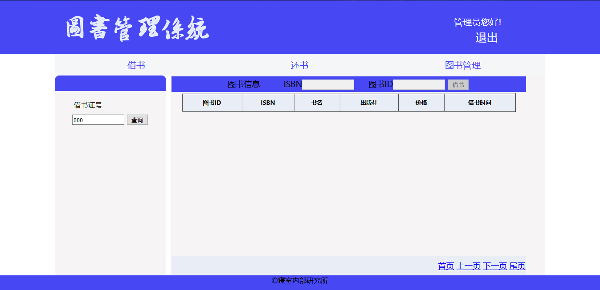

丁安琪的实验报告
============
## 实验五：图书管理系统数据库设计与界面设计

|学号|班级|姓名|
|:---------------:|:------------:|:------------:|
|201510414105|软件15-1|丁安琪|

### 1.表数据库设计

**1.1 图书表**

|字段|类型|主键，外键|可以为空|约束|说明|
|:-------:|:-------------:|:------:|:----:|:---:|:-----|    
|bookId|int(10)|主键|否||图书号|
|ISBN|varchar(10)| |否|||  
|bookName|varchar(50)| |否|||
|author|varchar(50)| |否|||  
|publisher|varchar(50)| |否|||
|price|float(10)| |否|||  
|cnum|int(50)| |否|||
|snum|int(50)| |否|||  
|summary|varchar(50)| |是|||
|photo|varbinary(3000)| |是|||

**1.2 读者表**

|字段|类型|主键，外键|可以为空|约束|说明|
|:-------:|:-------------:|:------:|:----:|:---:|:-----|    
|readerId|varchar(10)|主键|否|||
|name|varchar(50)| |否|||  
|password|varchar(10)| |否|||
|sex|bit(1)| |否|||  
|born|datetime(100)| |否|||
|spec|varchar(100)| |否|||  
|num|int(100)| |否|||
|photo|varbinary(3000)| |否|||  

**1.3 图书管理员表**

|字段|类型|主键，外键|可以为空|约束|说明|
|:-------:|:-------------:|:------:|:----:|:---:|:-----|    
|bookAdminId|varchar(10)|主键|否|||
|name|varchar(50)| |否|||  
|password|varchar(10)| |否|||
|sex|bit(1)| |否|||  
|born|datetime(100)| |否|||
|photo|varbinary(3000)| |否|||  

**1.3 超级管理员表**

|字段|类型|主键，外键|可以为空|约束|说明|
|:-------:|:-------------:|:------:|:----:|:---:|:-----|    
|superAdminId|varchar(10)|主键|否|||
|name|varchar(50)| |否|||  
|password|varchar(10)| |否|||
|sex|bit(1)| |否|||  
|born|datetime(100)| |否|||
|photo|varbinary(3000)| |否|||  
**1.4 借书表**

|字段|类型|主键，外键|可以为空|约束|说明|
|:-------:|:-------------:|:------:|:----:|:---:|:-----|    
|id|int(10)|主键|否|||
|readerId|varchar(10)|外键|否|||  
|bookId|varchar(10)|外键|否|||
|ISBN|varchar(10)| |否|||  
|lendConfirm|bit(1)| |否|||
|returnRequest|bit(1)| |否|||  
|ltime|datetime| |否|||  

## 2. 界面设计
**2.1 借书界面设计**

- 用例图参见：借书设计用例
- 类图参见：借书类、图书类
- 顺序图参见：借书设计顺序图
- API接口如下：

1. 借书查询

- 功能：用于获取指定读者借书信息
- 请求地址： http://localhost:8080/booksManage/lend.jsp
- 请求方法：GET
- 请求参数：readerId(String)

|参数名称|必填|说明|
|:-------:|:-------------: | :----------:|
|readerId|是|用于指定查询的读者 |
|method|是|固定为 “POST”。|

- 返回实例：
```
{
    "code": 200,
    "data": {
            "bookID": "sad",
            "ISBN": "sadasd-dasd-asdads",
            "bookName": 信息系统,
            "publisher": "清华大学出版社",
            "price": "98.00",
            "date": 2018-05-06,
     },
    "msg": "响应成功"
}
```
- 返回参数说明：
    
|参数名称|说明|
|:-------:|:-------------: |
|msg|请求响应结果|
|data|对应读者借阅图书信息|
|code|返回码|

2. 借书

- 功能：用于将书籍ID添加到读者借书表中
- 请求地址： http://localhost:8080/booksManage/lend.jsp
- 请求方法：GET
- 请求参数：readerId(String)

|参数名称|必填|说明|
|:-------:|:-------------: | :----------:|
|ISBN|是|用于指定图书编号 |
|bookId|是|用于指定图书ID |
|method|是|固定为 “POST”。|

- 返回实例：
```
{
    "code": 200,
    "data": {
            "bookID": "sad",
            "ISBN": "sadasd-dasd-asdads",
            "bookName": 信息系统,
            "publisher": "清华大学出版社",
            "price": "98.00",
            "date": 2018-05-06,
     },
    "msg": "响应成功"
}
```
- 返回参数说明：
    
|参数名称|说明|
|:-------:|:-------------: |
|msg|请求响应结果|
|data|查询的图书信息|
|code|返回码|


