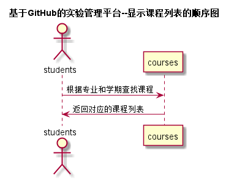
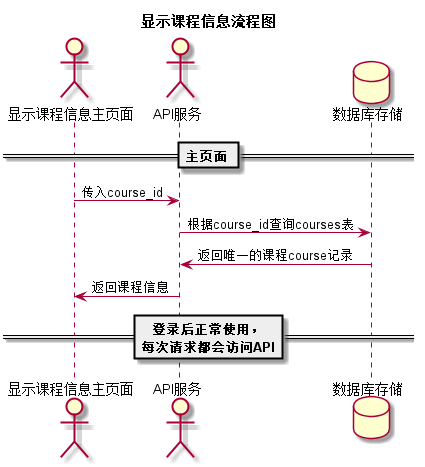

# “查看课程信息”用例 [返回](../../README.md)

## 1. 用例规约

|用例名称|查看课程信息|
|-------|:-------------|
|功能|学生/老师显示所有的课程并查看指定课程的信息|
|参与者|学生/老师|
|前置条件| 登录成功|
|后置条件||
|主事件流| 1.用户选择所修学期 2. 用户点击指定课程 3.系统根据课程号查询并返回课程信息 |
|备选事件流|学生未选择课程|

## 2. 业务流程（顺序图） [源码](../src/显示课程列表.puml)
 

## 3. 界面设计
- 界面参照: https://devil125860.github.io/is_analysis/test6/src/ui/查看课程.html
- API接口调用
    - 接口1：[getTerms](../接口/getTerms.md)
    - 接口2：[getCourses](../接口/getCourses.md)`
    - 接口3：[getCourseInfo](../接口/getCourseInfo.md)

## 4. 算法描述 [源码](../src/显示课程信息流程图.png)

    
## 5. 参照表

- [COURSES](../数据库设计/数据库设计.md/#COURSES)